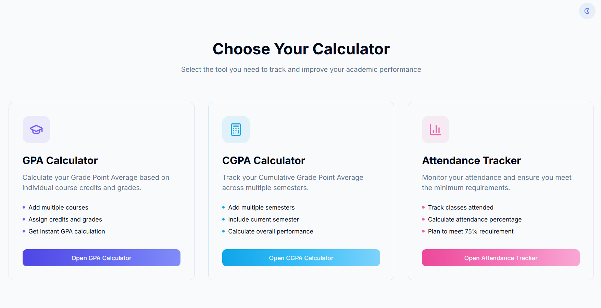

# 🎓 Academic Performance Calculator Web App

A clean and minimalist web application that allows users to calculate their GPA, CGPA, and determine the number of classes required to maintain a minimum attendance percentage (e.g., 75%). Designed for simplicity, ease of use, and aesthetic appeal.

---
##  Website

Visit the project here : [https://vit-gpa-calc.vercel.app/](https://vit-gpa-calc.vercel.app/)
---
## ✨ Features

### 📌 GPA Calculator

- Add multiple courses by entering:
  - Number of credits
  - Grade (S, A, B, C, D, E, F)
- Grade Mapping:
  - S = 10  
  - A = 9  
  - B = 8  
  - C = 7  
  - D = 6  
  - E = 5  
  - F = 0 (Fail)
- Option to delete mistakenly entered courses
- GPA Formula:

  ```
  GPA = (Σ Grade Points × Credits) / Σ Credits
  ```

---

### 📘 CGPA Calculator

- Enter the number of semesters completed
- For each semester, input:
  - GPA
  - Credits earned
- Optionally include the current semester's GPA and credits
- CGPA Formula:

  ```
  CGPA = (Σ GPA × Credits) / Σ Credits
  ```

---

### 📅 Attendance Calculator

- Input:
  - Total number of classes conducted
  - Number of classes attended so far
- Output:
  - Current attendance percentage
  - Number of consecutive classes needed to reach 75% attendance if currently below
- Calculation Logic:

  ```
  Required Attendance (%) = 75%

  If current attendance < 75%:
    Find the minimum x such that:
    (Attended + x) / (Total + x) ≥ 0.75
  ```


## 🚀 Getting Started

### Prerequisites

- Any modern web browser (Chrome, Firefox, Edge, etc.)

### Running Locally

1. Clone the repository:

```bash
git clone https://github.com/Sarvesh200416/ACADEMIC-PERFORMACE-CALCULATOR.git
cd ACADEMIC-PERFORMACE-CALCULATOR
```

2. Open the HTML file in your browser:

```bash
open index.html
```

Or with VSCode + Live Server:

```bash
Right-click → Open with Live Server
```

---

## 🛠️ Technologies Used

- HTML5  
- CSS3  
- JavaScript

---

## 📷 Screenshots



---

## 👨‍🎓 Author

- Developed by Sarvesh.R.R

---

